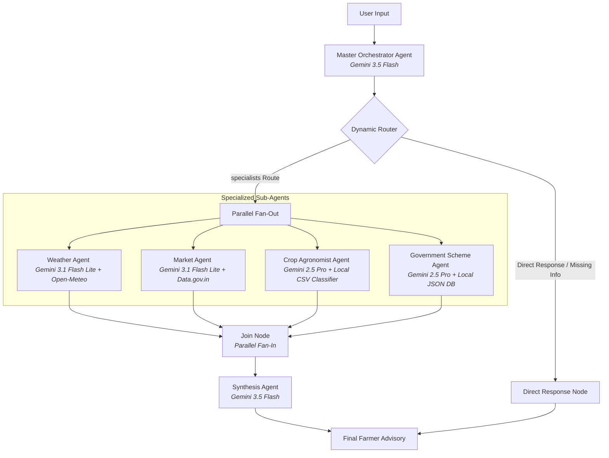

# 🌾 Kisan Agent: Multi-Agent Agriculture Advisory System

**Kisan Agent** is a production-ready, multi-agent decision support system powered by **Google ADK (Agent Development Kit) 2.0** and the **Gemini 3.5 / 2.5 model family**. It is designed to assist Indian farmers by providing real-time, localized, and actionable recommendations in English, Hindi, and Tamil.

The system integrates live weather forecasting, real-time market (mandi) commodity pricing, data-grounded soil crop recommendation, and government aid eligibility evaluation into a single, cohesive advisory report.

---

## 🏗️ Architecture Overview

Kisan Agent utilizes a **dynamic router and self-gating parallel fan-out pattern** inside an asynchronous graph workflow.



### Flow Breakdown
1. **Master Orchestrator**: Processes natural language input, updates the farmer's profile, imputes missing soil metrics, and requests downstream specialists.
2. **Dynamic Router**: Routes directly to the user if more questions are needed (lazy parameter collection), or triggers the parallel fan-out.
3. **Specialized Agents**:
   - **Weather Agent**: Geocodes locations and queries the Open-Meteo API for 14-day forecasts or 30-day history.
   - **Market Agent**: Calls the data.gov.in API to retrieve wholesale mandi rates (Rupees/quintal and Rupees/kg) and offers fallback suggestions.
   - **Crop Agronomist**: Leverages a local CSV classifier (centroid matching using Z-score distance from the Kaggle crop recommendation dataset) to match soil N-P-K-pH values.
   - **Government Scheme Agent**: Matches land size, income, and disaster reports against local regional scheme databases.
4. **Synthesis Agent**: Aggregates specialists' JSON findings, translates them entirely into the farmer's preferred language, and provides proactive advisories and contextual follow-up questions.

---

## ⚡ Engineering & Performance Highlights

* **Asynchronous Non-blocking Execution**: Network calls are parallelized using `httpx.AsyncClient` inside the graph's specialist nodes, ensuring parallel execution and fast response times.
* **Session-Scoped Tracing & Structured Logging**: Utilizes `contextvars` to propagate unique request session IDs across all async threads and agent nodes, making tracing and debugging in Cloud Logging trivial.
* **Fail-Safe TTL API Caching**: Features a robust, lightweight caching layer:
  - **Geocoding**: 24-hour cache TTL
  - **Mandi Prices**: 1-hour cache TTL
  - **Weather Forecast**: 30-minute cache TTL
* **Strict Type Safety**: Every agent node enforces Pydantic structured output contracts (e.g., `WeatherOutput`, `MarketOutput`, `CropOutput`, `SchemeOutput`).
* **Multi-Lingual Integration**: Dynamically detects and outputs responses in the farmer's preferred language (English, Hindi, Tamil) with natural agricultural phrasing.

---

## 📂 Project Structure

```
kisan-agent/
├── app/
│   ├── agents/            # Specialized Agent Nodes (Orchestrator, Crop, Weather, etc.)
│   ├── app_utils/         # Session-scoped Logging, Telemetry, and Feedback Schemas
│   ├── core/              # Config, Constants, and Pydantic Schemas
│   ├── data/              # Kaggle CSV crop recommendations & Local JSON schemes
│   ├── providers/         # Adapter classes (Open-Meteo, Data.gov.in, Local caches)
│   ├── tools/             # Nominatim Geocoding Tool
│   ├── agent.py           # Main ADK Workflow / Graph definition
│   └── fast_api_app.py    # FastAPI web application wrapper
├── tests/
│   ├── unit/              # Isolated mocked unit tests (100% passes)
│   ├── integration/       # E2E runner tests
│   └── eval/              # Multi-turn/multi-lingual evaluation datasets
├── Dockerfile             # Hardened non-root production Docker image
└── pyproject.toml         # Python packaging & dependencies using uv
```

---

## 🚀 Getting Started

### Prerequisites
- **Python 3.12+**
- **uv**: Fast Python package manager ([Install](https://docs.astral.sh/uv/getting-started/installation/))
- **google-agents-cli**: Install with `uv tool install google-agents-cli`

### Installation
Clone the repository and install all packages:
```bash
agents-cli install
```

Configure your environment variables:
```bash
cp .env.example .env
# Open .env and add your GEMINI_API_KEY and DATA_GOV_IN_API_KEY (optional)
```

### Local Testing & Interactive Playground
Start the interactive developer interface to chat with the agent and inspect workflow traces:
```bash
agents-cli playground
```

---

## 🧪 Testing & Evaluation

### Unit Tests
Run unit tests to verify mocked providers, agents, and parsing utilities:
```bash
uv run pytest tests/unit
```

### Quality Evaluations
Generate execution traces and grade them using LLM-as-a-judge against the custom 8-case evaluation dataset:
```bash
# Generate execution traces
agents-cli eval generate

# Grade the results against general quality metrics
agents-cli eval grade
```

---

## 🐳 Deployment

The project is fully prepared for containerized deployment on Cloud Run or GKE.

1. Set your active Google Cloud project:
   ```bash
   gcloud config set project <YOUR-PROJECT-ID>
   ```
2. Build and deploy the agent using the CLI:
   ```bash
   agents-cli deploy
   ```

*Note: The `Dockerfile` compiles the virtual environment and executes the service using a non-privileged `appuser` (UID/GID 1000/1000) for strict container hardening.*
