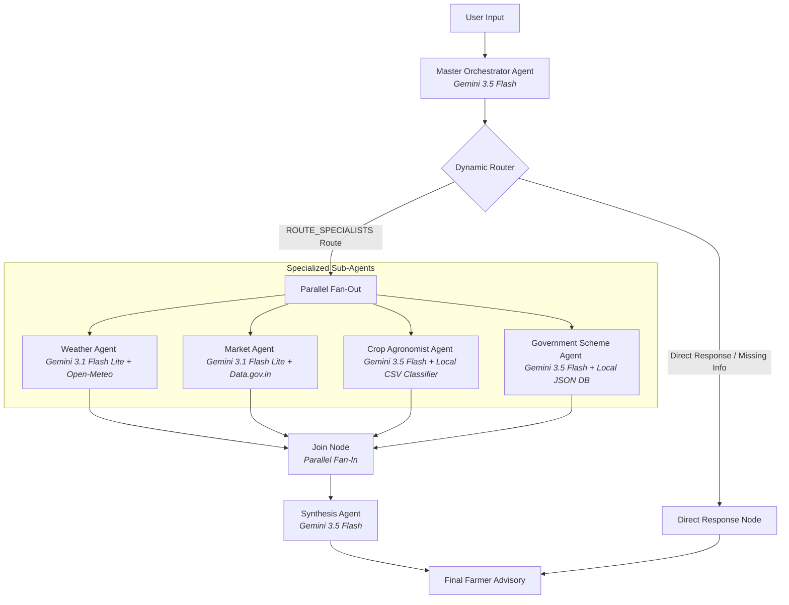

# 🌾 Kisan Agent: Multi-Agent Agriculture Advisory Prototype

**Kisan Agent** is a capstone project demonstrating a multi-agent decision support prototype, built using **Google ADK (Agent Development Kit) 2.0** and **Gemini 3.5 / 3.1 model family**. Developed as part of the Google AI Agents Capstone course, it showcases how a stateful graph-based workflow can aggregate public meteorology, commodity pricing, and local crop data to compile structured bilingual advisory reports in Tamil, English, and Hindi.

---

## 🏗️ Architecture & Workflow

The prototype utilizes a static graph workflow in ADK 2.0 to coordinate multiple specialized nodes. A self-gating parallel pattern is used to run active agents without blocking the graph.



### Component Flow
1. **Master Orchestrator**: Extracts user profile information (location, N-P-K soil metrics, land size) and saves it to the session state. It determines which specialized sub-agents are needed for the query.
2. **Dynamic Router**: Routes directly to the user if more questions are needed (such as asking for the location), or triggers the parallel fan-out.
3. **Specialized Agents (Self-Gating)**:
   - **Weather Agent**: Geocodes locations and queries the Open-Meteo API for forecasts.
   - **Market Agent**: Calls the data.gov.in API to retrieve wholesale commodity prices.
   - **Crop Agronomist**: Evaluates N-P-K soil metrics against a local crop centroid model.
   - **Government Scheme Agent**: Matches profile attributes (land size, income, region) against local scheme databases.
4. **Synthesis Agent**: Aggregates the results and translates the advice into the farmer's preferred language.

---

## 🔌 Data Sources & Attributions

This prototype integrates the following data sources:
1. **Weather Forecasts**: Asynchronous fetches from the [Open-Meteo API](https://open-meteo.com/).
   - *Attribution*: Weather data by [Open-Meteo.com](https://open-meteo.com/) (Licensed under CC BY 4.0).
2. **Commodity Prices**: Wholesale prices retrieved from the Indian government's open data portal ([Data.gov.in Mandi API](https://data.gov.in/)).
   - *Attribution*: Data sourced from Ministry of Agriculture and Farmers Welfare, India, under the National Data Sharing and Accessibility Policy (NDSAP).
3. **Soil Crop Suitability**: Recommendations are mapped mathematically using a local centroid model derived from the open [Kaggle Crop Recommendation Dataset](https://www.kaggle.com/datasets/atharvaingle/crop-recommendation-dataset).
4. **Government Schemes**: Scheme eligibility logic is matched against a local mock JSON database of Indian agricultural subsidies (e.g., PM-KISAN).

---

## ⚙️ Key Implementation Features

* **Asynchronous Execution**: Network calls to external APIs are parallelized using `httpx.AsyncClient` within the graph nodes to prevent bottlenecks.
* **In-Memory Caching**: Implements a simple Time-To-Live (`TtlCache`) layer (24h for geocoding, 1h for mandi prices, 30m for weather) to respect API rate limits and minimize redundant network requests.
* **IP-Based Rate Limiting**: A lightweight FastAPI middleware enforces a per-IP sliding-window rate limit (default: **10 requests per minute**) on all `/api/` and `/a2a/` endpoints. This protects the Gemini/Vertex AI backend from quota exhaustion by malicious users or bots, without requiring an external WAF or load balancer.
* **Telemetry Tracing**: Uses context variables to bind a unique `session_id` to each invocation, facilitating tracing in Cloud Logging.
* **Structured Output Validation**: Enforces type safety across nodes using Pydantic schemas (e.g., `WeatherOutput`, `MarketOutput`, `CropOutput`, `SchemeOutput`).
* **Friendly Console Logs**: Uses a custom ADK `FriendlyLoggingPlugin` to print colored, emoji-enriched logs showing step-by-step tool calls, agent runs, and state transitions in the terminal.

---

## 🛡️ Rate Limiting & Security

The deployed Cloud Run service is protected by a multi-layered security strategy:

| Layer | Mechanism | Default |
|-------|-----------|---------|
| **IP Rate Limiting** | FastAPI middleware with sliding window | 10 req/min per IP |
| **Instance Cap** | Cloud Run `--max-instances` | 2 containers max |
| **Zero-Idle Scaling** | Cloud Run scales to 0 when idle | $0.00 base cost |
| **Billing Budget** | GCP billing alert threshold | ₹1,000/month |

### Configuring Rate Limits

The rate limiter is configurable via environment variables at deploy time (no code changes needed):

| Variable | Description | Default |
|----------|-------------|---------|
| `RATE_LIMIT_REQUESTS` | Maximum requests allowed per IP per window | `10` |
| `RATE_LIMIT_WINDOW` | Sliding window duration in seconds | `60` |

To adjust at deploy time:
```bash
gcloud run services update kisan-agent \
  --update-env-vars "RATE_LIMIT_REQUESTS=20,RATE_LIMIT_WINDOW=60" \
  --region us-central1
```

## ⚠️ Prototype Limitations & Real-World Considerations

As a capstone project prototype, this agent is not intended for commercial production use without addressing the following constraints:
* **Public API Rate Limits**: The Nominatim geocoding and Open-Meteo APIs run on public, free tiers. Commercial scaling would require paid enterprise endpoint configurations.
* **Data Completeness**: Data.gov.in mandi uploads are dependent on local market reporting and frequently contain delays or missing entries. A real-world application would need more reliable proprietary commodity feeds.
* **Agronomical Rigor**: The crop matching is based on Euclidean centroid distance from a static Kaggle dataset. Professional agricultural advice requires integration with certified soil testing laboratories and dynamic regional agronomy models.
* **Security & Auth**: The API calls and container are structured for prototype demonstration. Production deployment would require network segregation, secret management hardening, and authenticated API gateways.

---

## 🚀 Getting Started

### Local Setup
1. Install Python 3.12+ and [uv](https://docs.astral.sh/uv/getting-started/installation/).
2. Install dependencies:
   ```bash
   agents-cli install
   ```
3. Copy `.env.example` to `.env` and set your `GEMINI_API_KEY`.
4. Launch the local chat interface:
   ```bash
   agents-cli playground
   ```

### Running Tests
* Run unit tests: `uv run pytest tests/unit`
* Run integration tests: `uv run pytest tests/integration`
